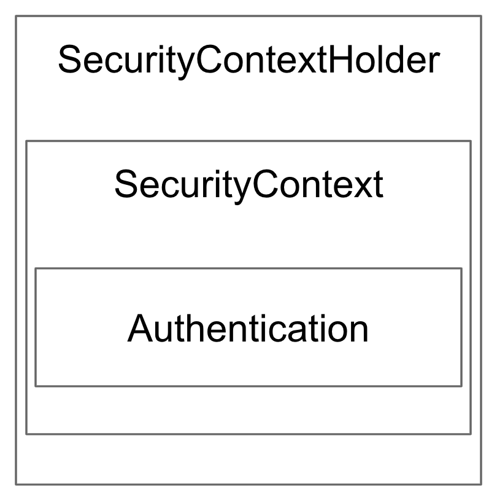

# SecurityContextHolder And Authentication

* * *

## SecurityContextHolder
* * *
- SecurityContext 제공, 기본적으로 TreadLocal을 사용한다.

* * *

## SecurityContext
* * *

- Authentication 제공
* * *

## Authentication
* * *

- Principal과 GrantAuthority 제공

* * * 
## Principal
* * *

- "누구"에 해당하는 정보
- UserDetailsService에서 리턴한 객체
- 객체의 타입은 UserDetail

* * *

## GrantAuthority

* * *

- "ROLE_USER", "ROLE_ADMIN"등 Principal이 가지고 있는 "권한"을 나타낸다.
- 인증 이후, 인가 및 권한 확인할 때 이 정보를 참조한다.

* * *
## UserDatails

* * *

- 애플리케이션이 가지고 있는 유저 정보와 스프링 시큐리티가 사용하는 
  Authentication 객체 사이의 어댑터
  
* * *

## UserDetailsService

* * *

- 유저 정보를 UserDetails 타입으로 가져오는 DAO(Data Access Object) 인터페이스
- 구현은 마음대로 하면 된다.

