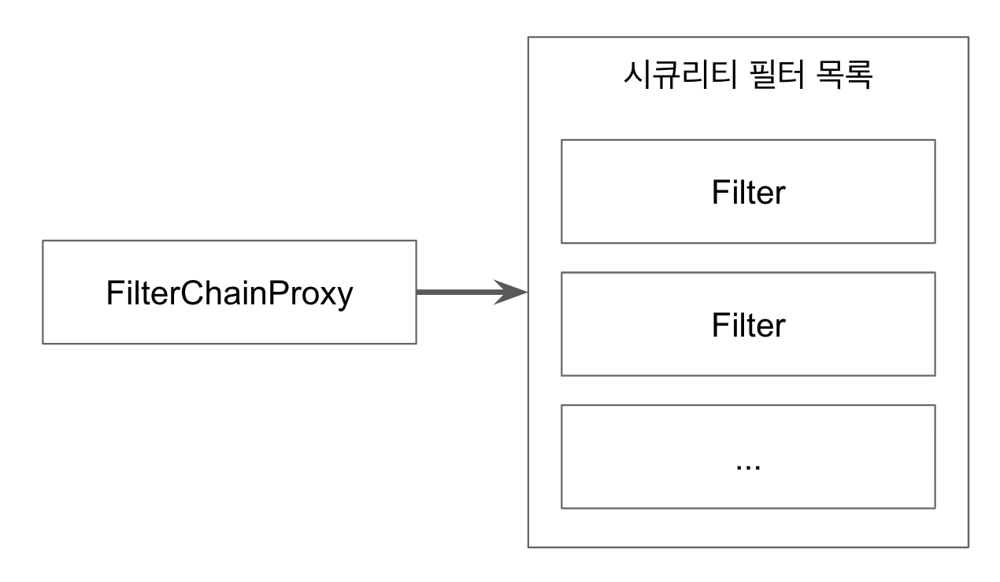

# Filter And FilterChainProxy

* * *

## Spring Security가 제공하는 Filter들

* * *

1. WebAsyncManagerIntegrationFilter
2. SecurityContextPersistenceFilter
3. HeaderWriterFilter
4. CsrfFilter
5. LogoutFilter
6. UsernamePasswordAuthenticationFilter
7. DefaultLoginPageGeneratingFilter
8. DefaultLogoutPageGeneratingFilter
9. BasicAuthenticationFilter
10. RequestCacheAwareFilter
11. SecurityContextHolderAwareRequestFilter
12. AnonymousAuthenticationFilter
13. SessionManagementFilter
14. ExceptionTranslationFilter
15. FilterSecurityInterceptor

###위 필터는 모두 FilterChainFroxy가 호출한다.

