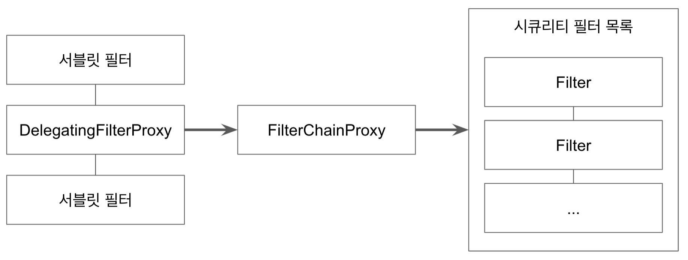

# DelegatingFilterProxy And FilterChainProxy

* * *

## DelegatingFilterProxy

* * *

- 일반적인 서블릿 필터
- 서블릿 필터 처리를 스프링에 들어있는 빈으로 위임하도 싶을 떄, 사용하는 서블릿 필터
- 타겟 빈 이름을 설정함
- 스프링 부트 없이 스프링 시큐리티 설정할 땐,
  AbstractSecurityWebApplicationInitializer를 사용해서 등록.
- 스프링 부트를 사용할 땐, 자동으로 등록된다. (SecurityFilterAutoConfiguration)

* * *

## FilterChainProxy

* * *

- 보통 "SpringSecurityFilterChain"이라는 이름의 빈으로 등록된다.

