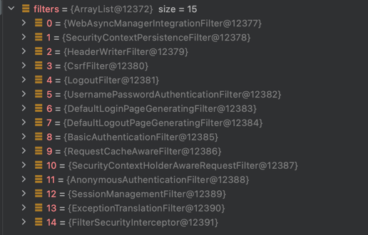

# ignoring

* * *

### WebSecurity의 ignoring()을 사용해서 시큐리티 필터 적용을 제외할 요청을 설정 가능

- 스프링 부트가 제공하는 PathRequest를 사용하여 정적 자원 요청을 스프링 시큐리티 필터가 적용하지 않도록 설정
    - 이경우 FilterChain을 거치지 않음.
  ~~~ java
   public void configure(WebSecurity web) throws Exception {
    web.ignoring().requestMatchers(PathRequest.toStaticResources().atCommonLocations());
   }
  ~~~

* * *

## 또 다른 방법

* * *

~~~ java
  @Override
  protected void configure(HttpSecurity http) throws Exception {
    http.authorizeRequests()
        .antMatchers("/", "/info", "/account/**").permitAll() // 누구나 접근 가능
        .mvcMatchers("/admin").hasRole("ADMIN") // hasRole로 접근 가능한 권한 부여
        .mvcMatchers("/user").hasRole("USER")
        .requestMatchers(PathRequest.toStaticResources().atCommonLocations()).permitAll()
        .anyRequest().authenticated() // anyRequest().authenticated() <- 그 외 인증만 하면 접근 가능
        .expressionHandler(expressionHandler());
    http.formLogin();
    http.httpBasic();
  }
~~~

- 위와 같이 하나에 설정할 수도 있지만,
    - FilterChain 15개를 거치게 되므로, 리소스 낭비가 발생하게 된다.(권장 X)

* * *

## 정리

* * *

**정적 리소스는 WebSecurity.ignore()를 권장**하며,
**예외적인 정적 자원 (인증이 필요한 정적자원이 있는 경우)는 http.authorizeRequests()를 사용**할 수 있다.

~~~ java
   public void configure(WebSecurity web) throws Exception {
    web.ignoring().requestMatchers(PathRequest.toStaticResources().atCommonLocations());
  }
~~~   

- **동적 리소스는 http.authorizeRequests()에서 처리**하는 것을 권장

~~~ java
  @Override
  protected void configure(HttpSecurity http) throws Exception {
    http.authorizeRequests()
        .antMatchers("/", "/info", "/account/**").permitAll() // 누구나 접근 가능
        .mvcMatchers("/admin").hasRole("ADMIN") // hasRole로 접근 가능한 권한 부여
        .mvcMatchers("/user").hasRole("USER")
        .requestMatchers(PathRequest.toStaticResources().atCommonLocations()).permitAll()
        .anyRequest().authenticated() // anyRequest().authenticated() <- 그 외 인증만 하면 접근 가능
        .expressionHandler(expressionHandler());
    http.formLogin();
    http.httpBasic();
  }
~~~
