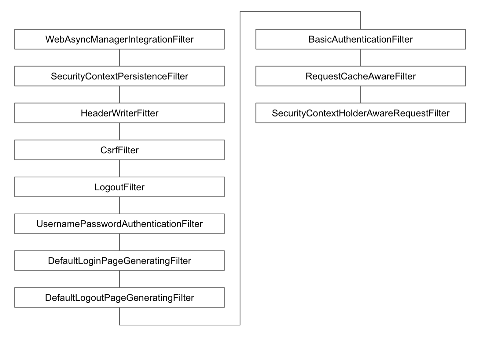

# 요청 캐시 필터: RequestCacheAwareFilter

* * *

## 현재 요청과 관련 있는 캐시된 요청이 있는지 찾아서 적용하는 필터.

* * *

- 캐시된 요청이 없다면, 현재 요청 처리
- 캐시된 요청이 있다면, 해당 캐시된 요청 처리

* * *

# 시큐리티 관련 서블릿 스팩 구현 필터: SecurityContextHolderAwareRequestFilter

* * *

## 시큐리티 관련 서블릿 API를 구현해주는 필터

* * *

- HttpServletRequest#authenticate(HttpServletResponse)
- HttpServletRequest#login(String, String)
- HttpServletRequest#logout()
- AsyncContext#start(Runnable)

