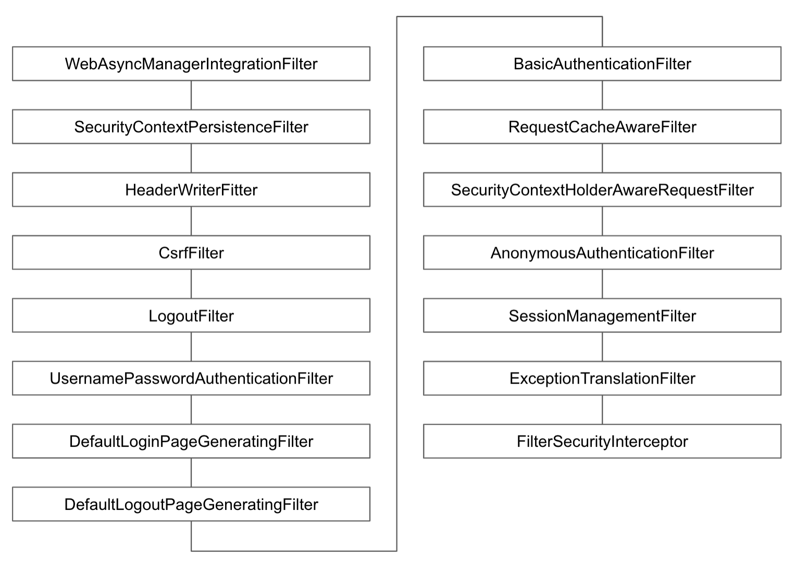

# 인가 처리 필터: FilterSecurityInterceptor

* * *

### HTTP 리소스 시큐리티 처리를 담당하는 필터. 
### AccessDecisionManager를 사용하여 인가를 처리한다.   

- HTTP 리로스 시큐리티 설정
~~~java
http.authorizeRequests()
    .mvcMatchers("/", "/info", "/account/**", "/signup").permitAll()
    .mvcMatchers("/admin").hasAuthority("ROLE_ADMIN")
    .mvcMatchers("/user").hasRole("USER")
    .anyRequest().authenticated()
    .expressionHandler(expressionHandler());
~~~

