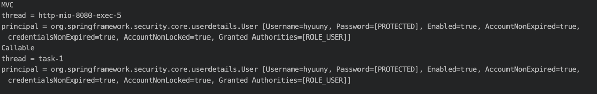

# WebAsyncManagerIntegrationFilter

* * *

### 스프링 MVC의 Async 기능(핸들러에서 Callable을 리턴할 수 있는 기능)을 사용할 때에도 SecurityContext를 공유하도록 도와주는 필터.

~~~ java
  @GetMapping("/async-handler")
  @ResponseBody // 응답에 대한 요청값을 body에 실어 보냄.
  public Callable<String> asyncHandler() {
    SecurityLogger.log("MVC"); // thread = http-nio-8080-exec-5
    return () -> {
      SecurityLogger.log("Callable"); // thread = tesk-1
      return "Async Handler";
    };
  }
  
  // logger 
  public static void log(String message) {
    System.out.println(message);
    Thread thread = Thread.currentThread();
    System.out.println("thread = " + thread.getName());
    Object principal = SecurityContextHolder.getContext().getAuthentication().getPrincipal();
    System.out.println("principal = " + principal);
  }
~~~

- 서로 다른 쓰레드이지만, 동일한 Principal을 참조한 것을 확인할 수 있다.
    - Async 기능을 사용할 떄, **SecurityContext를 공유**하였기 때문.
    - PresProcess : 새로 만든 Thread에 Integration해준다.
    - Callable : 그렇기 때문에 Callable안에서는 Thread가 달라도 동일한 SecurityContext를 참조할 수 있다.
    - PostProcess : SecurityContext는 요청을 마치면, Clean Up 해야 하는데, 이 작업을 하게 된다.
      
    

