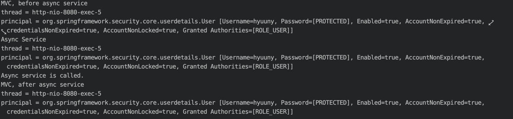
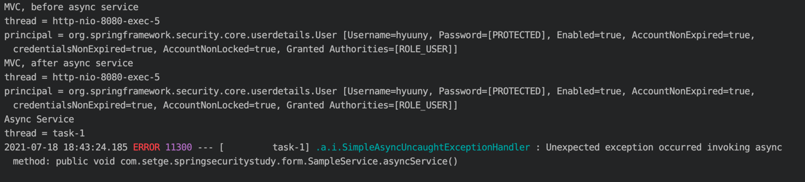
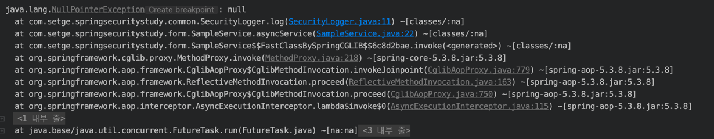
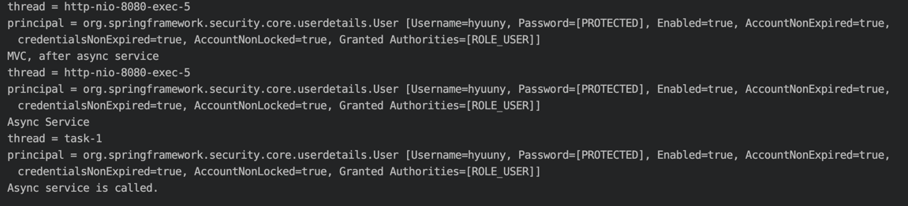

# Spring Security And @Async

* * *

- SecurityContext를 자식 쓰레드에도 공유하는 전략.
- @Async를 처리하는 쓰레드에서도 SecurityContext를 공유받을 수 있다.

### 위에서 설명하는 내용이 무슨 말인지 아래 테스트를 통해 알아보자.    

~~~ java

  @GetMapping("/async-service")
  @ResponseBody
  public String asyncService() {
    SecurityLogger.log("MVC, before async service");
    sampleService.asyncService();
    SecurityLogger.log("MVC, after async service");
    return "Async Handler";
  }
  
  @Async // 별도의 Thread를 만들어서 비동기로 호출해준다.
  public void asyncService() {
    SecurityLogger.log("Async Service");
    System.out.println("Async service is called.");
  }

~~~

- @Asycn를 설정했지만, 3개의 Thread 모두 동일한 쓰레드 이다.
    - 왜일까?
    - Async하게 사용하기 위해서는 @EnableAsync 어노테이션을 적용해야 한다.

~~~ java
@SpringBootApplication
@EnableAsync <- 기본적인 Thread Pool 사용
public class SpringSecurityStudyApplication {
~~~

* * *
## @EnableAsync 적용 후, 테스트

* * *

- 이번에는 원하는 대로 서로 다른 쓰레드지만, 예외가 발생하였다.
    - **@Async를 사용한 곳에서는 SpringSecurityContext가 공유되지 않아**,
  service에서 호출하는 principal이 null이기 때문에 npe가 발생하였다.
    - 즉, 서로 다른 Thread이므로, 다른 SpringSecurityContext를 참조하였다는 것.   
    
    
- **SecurityContextHolder의 StrategyName은 SecurityContext 정보를 어떻게 유지할 지
  , 어디까지 공유할지 설정할 있는데, ThreadLocal이 기본값으로 설정되어 있다.**  
  - 동일한 Thread 내에서만 정보를 공유하기 때문에, 위와 같은 에러가 발생한 것이였다.
    

* * *

## SecurityContextHolder의 setStrategyName 설정 후, 테스트 

* * *

~~~ java
   @Override
  protected void configure(HttpSecurity http) throws Exception {
    http.authorizeRequests()
        .antMatchers("/", "/info", "/account/**").permitAll() // 누구나 접근 가능
        .mvcMatchers("/admin").hasRole("ADMIN") // hasRole로 접근 가능한 권한 부여
        .mvcMatchers("/user").hasRole("USER")
        .anyRequest().authenticated() // anyRequest().authenticated() <- 그 외 인증만 하면 접근 가능
        .expressionHandler(expressionHandler());
    http.formLogin();
    http.httpBasic();

      SecurityContextHolder.setStrategyName(SecurityContextHolder.MODE_INHERITABLETHREADLOCAL);
  }

~~~
 
    

- Thread가 달라도 같은 SecurityContext를 참조하는 것을 확인할 수 있다.
    - 이와 같이 **SecurityContextHolder.MODE_INHERITABLETHREADLOCAL**로 설정하면, 
      현재 Thread에서 하위 Thread에도 SecurityContext의 정보가 **공유** 된다.
  

