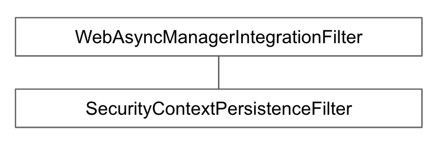

# SecurityContextPersistenceFilter

* * *

### SecurityContextRepository를 사용해서 기존의 SecurityContext를 읽어오거나 초기화 한다.

- 모든 인증 Filter보다 위에 있다.
- HTTP Session을 기본 전략으로 사용한다.
  - HttpSession에서 기존에 만들어진 SecurityContext를 읽어오거나, 인증 Filter를 다 확인했는데도 없다면 비어있는 SecurityContext를 만든다.
- Spring-Session과 연동하여 세션 클러스터를 구현할 수 있다.

