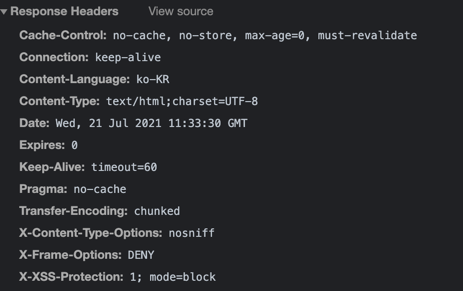

# HeaderWriterFilter

* * *

## 응답 헤더에 시큐리티 관련 헤더를 추가해주는 필터

* * * 
- 기본적으로 5개의 HeaderWriter가 적용 된다.

|필터명|특징|
|---|---|
|XContentTypeOptionsHeaderWriter|마임 타입 스니핑 방어|
|XXssProtectionHeaderWriter|브라우저에 내장된 XSS 필터 적용|
|CacheControlHeadersWriter|캐시 히스토리 취약점 방어|
|HstsHeaderWriter|HTTPS로만 소통하도록 강제|
|XFrameOptionsHeaderWriter|clickjacking 방어|

- X-Content-Type-Option : XContentTypeOptionsHeaderWriter
- X-XSS-Protection : XXssProtectionHeaderWriter
- Cache-Control, Expires, Pragma : CacheControlHeadersWriter
- X-Frame-Options : XFrameOptionsHeaderWriter