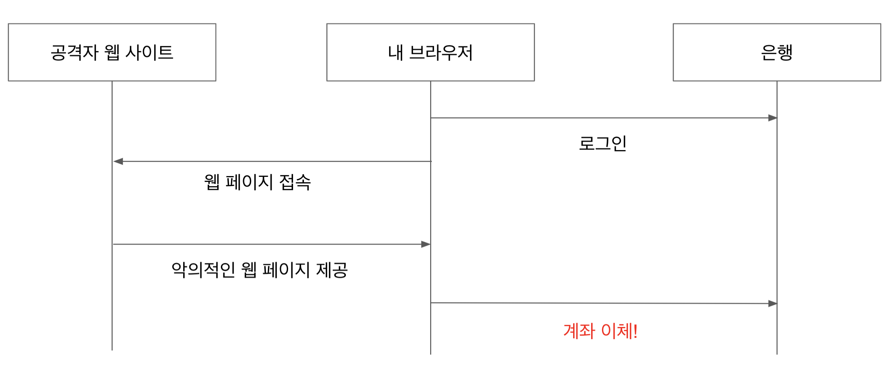
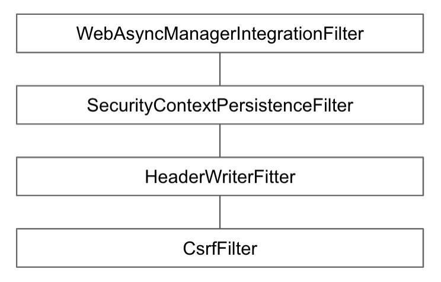

# Csrf Filter

* * *

## CSRF 어택 방지 필터

* * *

- 인증된 유저의 계정을 사용해 악의적인 변경 요청을 만들어 보내는 기법.
- CORS를 사용할 때 특히 주의 해야 한다.
    - 타 도메인에서 보내오는 요청을 허용하기 때문
    

- 의도한 사용자만 리소스를 변경할 수 있도록 허용하는 필터
    - CSRF 토큰을 사용하여 방지
    

