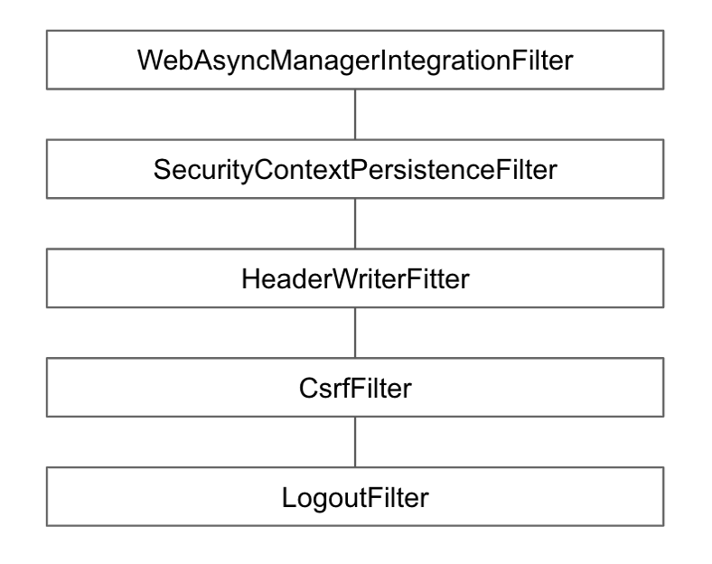

# LogoutFilter

* * *

## 여러 LogoutHandler를 사용하여 로그아웃시 필요한 처리 하며, 이후에는 LogoutSuccessHandler를 사용하여 로그아웃 후처리를 한다.

* * *

- LogoutHandler
    - CsrfLogoutHandler
    - SecurityContextLogoutHandler   
    
    
- LogoutSuccessHandler
  - SimpleUrlLogoutSuccessHandler
    
* * *

## 로그아웃 필터 설정

* * *

```
    http.logout()  
        .logoutUrl("/logout")
        .logoutSuccessUrl("/")
        .logoutRequestMatcher()
        .invalidateHttpSession(true)
        .deleteCookies()
        .addLogoutHandler()
        .logoutSuccessHandler();
```   
   
   
