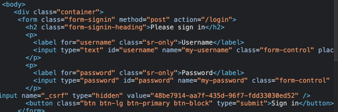
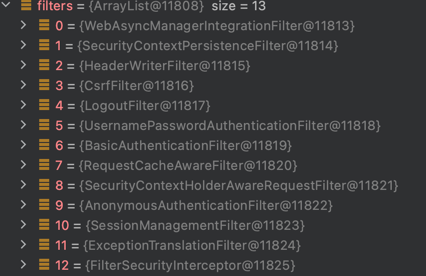
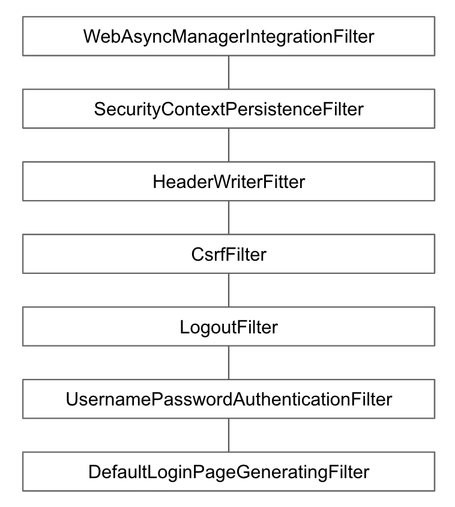

# DefaultLoginPageGeneratingFilter

* * *

## 기본 로그인 폼 페이지를 생성해주는 필터

* * *
- GET /login 요청을 처리하는 필터   

- 로그인폼 커스터 마이징
    - 설정을 통해 로그인 시 username과 password르 원하는 name(파라미터)로 받을 수 있다.
~~~
        http.formLogin()
            .usernameParameter("my-username")
            .passwordParameter("my-password");
~~~

* * *

## loginPage

* * *

- 로그인 페이지 커스터 마이징
    - 로그인 요청 페이지와 로그아웃 요청 페이지를 원하는 페이지로 변경할 수 있다.
~~~
    http.formLogin()
        .loginPage("/signin");
~~~

- 위 설정을 하게 되면, 스프링시큐리티에서 기본으로 제공하는 페이지를 사용하지 않으므로,
  더 이상 아래 두 필터는 사용하지 않게된다.
    - DefaultLoginPageGeneratingFilter
    - DefaultLogoutPageGeneratingFilter

* * *

